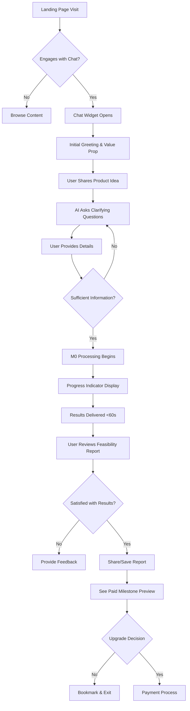
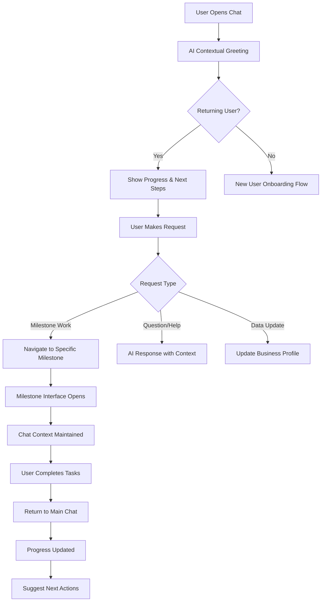
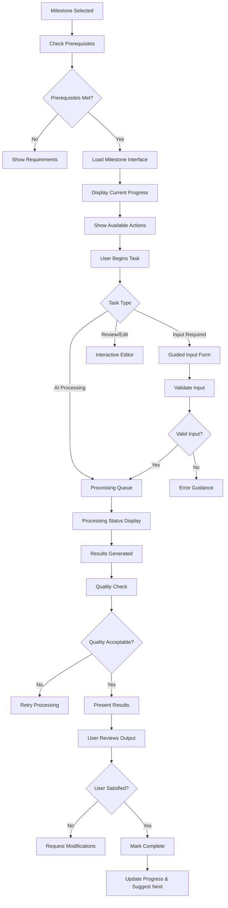
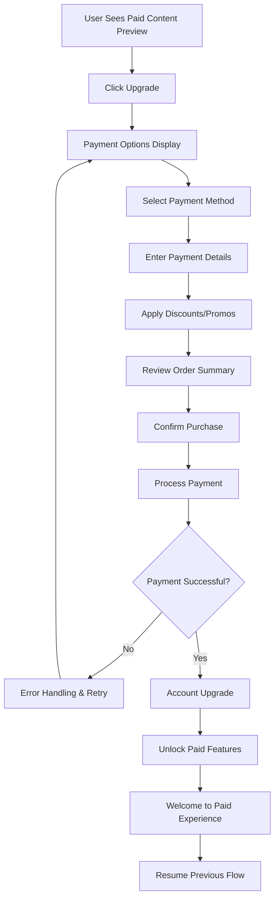
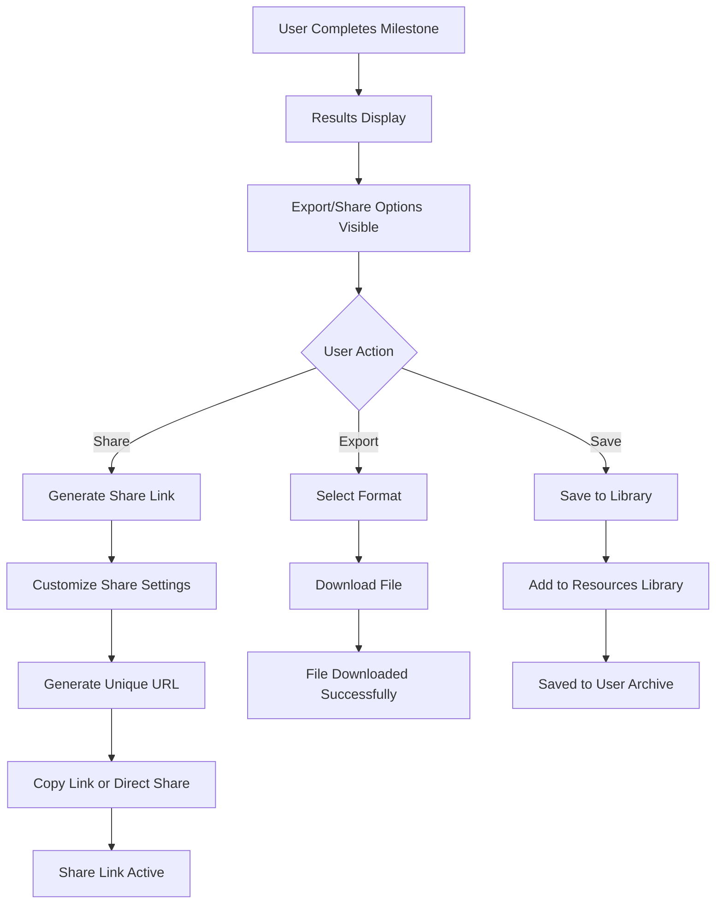

# ProLaunch.AI Information Architecture & Interaction Flows

## Overview
This document defines the information architecture, navigation structure, and key interaction flows for the ProLaunch.AI chat-first ecommerce validation platform.

---

## Primary Information Architecture

### Site Structure Hierarchy
```
ProLaunch.AI Root
├── Landing Page (Public)
│   ├── Value Proposition Section
│   ├── Social Proof & Success Stories
│   ├── Feature Preview Gallery
│   ├── Pricing Information
│   ├── Chat Widget (Persistent)
│   └── Footer Navigation
│       ├── Privacy Policy
│       ├── Terms of Service
│       ├── Contact Information
│       └── Help Documentation
│
├── Application Dashboard (Authenticated)
│   ├── Progress Overview
│   │   ├── Milestone Completion Status (M0-M9)
│   │   ├── Overall Progress Percentage
│   │   ├── Next Recommended Actions
│   │   └── Recent Activity Timeline
│   │
│   ├── Chat Interface (Primary Navigation Hub)
│   │   ├── Active Conversation Thread
│   │   ├── Conversation History Archive
│   │   ├── Milestone-Specific Chat Context
│   │   ├── Quick Action Templates
│   │   └── Help & Guidance Integration
│   │
│   ├── Milestones Hub
│   │   ├── M0: Feasibility Snapshot (Free)
│   │   │   ├── Viability Score Dashboard
│   │   │   ├── Competitive Analysis View
│   │   │   ├── Price Range Recommendations
│   │   │   ├── Citation Source Links
│   │   │   └── Share/Export Options
│   │   │
│   │   ├── M1: Unit Economics (Paid Gateway)
│   │   │   ├── Cost Breakdown Calculator
│   │   │   ├── Margin Analysis Tools
│   │   │   ├── Break-even Projections
│   │   │   ├── Red Flag Alert System
│   │   │   └── Assumption Editor Interface
│   │   │
│   │   ├── M2: Deep Research Pack (Paid)
│   │   │   ├── Extended Competitive Analysis
│   │   │   ├── Market Demand Insights
│   │   │   ├── Pricing Strategy Validation
│   │   │   ├── Risk Assessment Matrix
│   │   │   └── Source Citation Library
│   │   │
│   │   ├── M3: Supplier Shortlist (Paid)
│   │   │   ├── Supplier Comparison Table
│   │   │   ├── Contact Information Cards
│   │   │   ├── MOQ & Pricing Matrix
│   │   │   ├── Outreach Template Library
│   │   │   └── Communication Tracking
│   │   │
│   │   ├── M4: Financial Model (Paid)
│   │   │   ├── P&L Projection Dashboard
│   │   │   ├── Cash Flow Analysis
│   │   │   ├── Scenario Planning Tools
│   │   │   ├── Working Capital Calculator
│   │   │   └── Export/Download Center
│   │   │
│   │   ├── M5: Brand Positioning (Paid)
│   │   │   ├── Value Proposition Builder
│   │   │   ├── Customer Persona Gallery
│   │   │   ├── Brand Voice Guidelines
│   │   │   ├── Copy Block Library
│   │   │   └── Competitive Differentiation
│   │   │
│   │   ├── M6: Go-to-Market Plan (Paid)
│   │   │   ├── Channel Strategy Matrix
│   │   │   ├── Content Calendar Interface
│   │   │   ├── Campaign Brief Templates
│   │   │   ├── Budget Allocation Tools
│   │   │   └── ROI Projection Calculator
│   │   │
│   │   ├── M7: Website Brief (Paid)
│   │   │   ├── Sitemap Visualization
│   │   │   ├── Wireframe Gallery
│   │   │   ├── CRO Checklist Interface
│   │   │   ├── Platform Setup Guides
│   │   │   └── Technical Specification Export
│   │   │
│   │   ├── M8: Legal & Compliance (Paid)
│   │   │   ├── Business Structure Advisor
│   │   │   ├── License Requirements Checker
│   │   │   ├── Legal Template Library
│   │   │   ├── Compliance Risk Assessment
│   │   │   └── Attorney Referral Directory
│   │   │
│   │   └── M9: Launch Readiness (Free)
│   │       ├── 50-Point Checklist Interface
│   │       ├── Critical Path Visualization
│   │       ├── Red Flag Resolution Tracker
│   │       ├── Launch Approval Workflow
│   │       └── Shareable Summary Generator
│   │
│   ├── Resources Library
│   │   ├── Generated Documents Archive
│   │   │   ├── Feasibility Reports
│   │   │   ├── Financial Models
│   │   │   ├── Brand Guidelines
│   │   │   └── Technical Briefs
│   │   │
│   │   ├── Templates & Tools Collection
│   │   │   ├── Supplier Outreach Templates
│   │   │   ├── Financial Calculators
│   │   │   ├── Brand Assets
│   │   │   └── Marketing Materials
│   │   │
│   │   ├── Citation Sources Database
│   │   │   ├── Research Links Archive
│   │   │   ├── Source Credibility Ratings
│   │   │   ├── Last Updated Timestamps
│   │   │   └── Related Research Suggestions
│   │   │
│   │   └── Help Documentation Hub
│   │       ├── Getting Started Guide
│   │       ├── Feature Tutorials
│   │       ├── FAQ Database
│   │       ├── Video Walkthrough Library
│   │       └── Contact Support Interface
│   │
│   └── Account Management
│       ├── Profile & Preferences
│       │   ├── Personal Information
│       │   ├── Communication Preferences
│       │   ├── Notification Settings
│       │   └── Business Profile Data
│       │
│       ├── Subscription Management
│       │   ├── Current Plan Details
│       │   ├── Usage Analytics
│       │   ├── Payment Method Management
│       │   ├── Billing History
│       │   └── Upgrade/Downgrade Options
│       │
│       ├── Data Management
│       │   ├── Export All Data
│       │   ├── Delete Account
│       │   ├── Data Retention Settings
│       │   └── Privacy Controls
│       │
│       └── Support & Feedback
│           ├── Contact Support
│           ├── Feature Requests
│           ├── Bug Reports
│           └── User Satisfaction Surveys
```

---

## Core Interaction Flows

### Flow 1: New User Onboarding


### Flow 2: Chat-First Interaction Pattern


### Flow 3: Milestone Completion Workflow


### Flow 4: Payment & Upgrade Process


### Flow 5: Export & Sharing Workflow


---

## Navigation Design Principles

### Primary Navigation Strategy
1. **Chat-First Approach**: Main interface is conversational
2. **Progressive Disclosure**: Show only relevant next steps
3. **Context Preservation**: Maintain conversation history across navigation
4. **Quick Access**: One-click return to any previously accessed area

### Secondary Navigation Elements
- **Breadcrumb Navigation**: Clear path showing current location
- **Quick Actions Menu**: Frequently used functions accessible anywhere
- **Search Functionality**: Global search across all content and history
- **Help Integration**: Contextual help available on every screen

### Mobile-First Navigation Considerations
- **Thumb-Friendly Design**: All interactive elements optimized for mobile
- **Swipe Gestures**: Natural mobile interactions for navigation
- **Collapsible Sections**: Minimize screen real estate usage
- **Voice Input Support**: Alternative input method for chat interface

---

## Content Organization Strategies

### Information Hierarchy Principles
1. **User Goal Alignment**: Primary paths match user objectives
2. **Cognitive Load Management**: Limit choices at each decision point
3. **Scannability**: Key information easily identifiable
4. **Progressive Enhancement**: Core functionality works without JavaScript

### Content Prioritization Framework
**Primary Content**: Essential for user goal completion
- Milestone progress and next steps
- Active chat conversation
- Critical alerts and notifications

**Secondary Content**: Supporting information and tools
- Historical data and archives
- Reference materials and templates
- Account settings and preferences

**Tertiary Content**: Enhancement and optimization features
- Advanced analytics and insights
- Social sharing and collaboration
- Educational content and tutorials

### Responsive Content Strategy
**Mobile (320-767px)**:
- Chat interface takes full screen
- Single-column layout for all content
- Collapsed navigation with hamburger menu
- Essential actions prominently displayed

**Tablet (768-1023px)**:
- Split view with chat and content side-by-side
- Two-column layout for milestone content
- Expanded navigation visible
- Secondary actions in slide-out panels

**Desktop (1024px+)**:
- Multi-panel layout with chat, content, and sidebar
- Full navigation hierarchy visible
- All actions and options displayed
- Contextual sidebars with related information

---

## Interaction Pattern Library

### Chat Interface Patterns
1. **Message Types**:
   - User input messages (right-aligned, blue background)
   - AI response messages (left-aligned, gray background)
   - System notifications (center-aligned, subtle styling)
   - File/link attachments (preview cards)

2. **Input Patterns**:
   - Auto-expanding text area
   - Quick reply button options
   - File upload drag-and-drop
   - Voice input activation

3. **Response Patterns**:
   - Typing indicators during processing
   - Progressive message reveal for long responses
   - Citation links inline with content
   - Action buttons for next steps

### Milestone Interface Patterns
1. **Progress Indicators**:
   - Step-by-step progress bars
   - Completion checkmarks
   - Time remaining estimates
   - Prerequisite dependency visualization

2. **Input Forms**:
   - Smart defaults based on previous inputs
   - Real-time validation and feedback
   - Help tooltips for complex fields
   - Save draft functionality

3. **Results Display**:
   - Structured data presentation
   - Interactive charts and visualizations
   - Expandable detail sections
   - Export/sharing action buttons

### Feedback & Status Patterns
1. **Loading States**:
   - Skeleton screens during content loading
   - Progress spinners for quick actions
   - Detailed progress indicators for long processes
   - Estimated time remaining displays

2. **Error Handling**:
   - Inline validation messages
   - Non-blocking error notifications
   - Recovery action suggestions
   - Help contact options

3. **Success Confirmation**:
   - Positive action confirmations
   - Achievement celebrations
   - Next step recommendations
   - Social sharing opportunities

---

## Search & Discovery Architecture

### Search Functionality
- **Global Search**: Across all milestones, chat history, and resources
- **Scoped Search**: Within specific milestone content
- **Semantic Search**: AI-powered content understanding
- **Search History**: Recent searches and saved searches

### Content Discovery Mechanisms
- **Recommended Actions**: Based on user progress and behavior
- **Related Content**: Cross-milestone content relationships
- **Popular Resources**: Most-used templates and tools
- **Recent Activity**: Quick access to recently viewed content

### Filtering & Organization
- **Milestone Filters**: Show content by completion status
- **Date Ranges**: Filter by creation or modification time
- **Content Types**: Separate reports, templates, and resources
- **Tags & Categories**: User-defined organization system

---

## Data Relationships & Dependencies

### User Data Architecture
```
User Profile
├── Basic Information (name, email, preferences)
├── Business Profile (industry, stage, goals)
├── Progress Data (milestone completion, timestamps)
├── Chat History (full conversation archive)
├── Generated Content (all milestone outputs)
├── Custom Settings (notifications, sharing preferences)
└── Usage Analytics (engagement metrics, feature adoption)
```

### Milestone Dependencies
- **M0 → M1**: Feasibility insights inform unit economics
- **M1 → M2**: Cost assumptions guide research priorities
- **M2 → M3**: Market research informs supplier requirements
- **M3 → M4**: Supplier costs impact financial projections
- **M4 → M5**: Financial viability guides positioning strategy
- **M5 → M6**: Brand positioning informs go-to-market approach
- **M6 → M7**: Marketing strategy guides website requirements
- **M7 → M8**: Business structure affects legal requirements
- **M8 → M9**: All previous milestones populate launch checklist

### Content Relationship Mapping
- **Citation Tracking**: Link insights back to source research
- **Cross-References**: Connect related concepts across milestones
- **Version History**: Track changes to assumptions and outputs
- **Collaboration Links**: Share specific sections with stakeholders